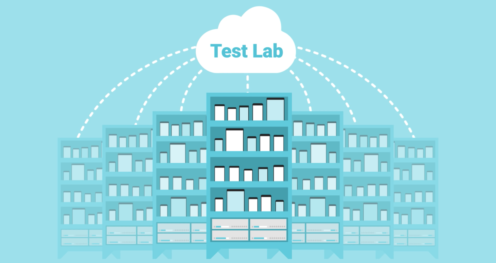

<p align="center">
  
</p>

# `Firebase Test Lab` plugin for _fastlane_

This project is a [fastlane](https://fastlane.tools) plugin. You can add it to your _fastlane_ project by running

```bash
fastlane add_plugin firebase_test_lab
```

---

[](https://rubygems.org/gems/fastlane-plugin-firebase_test_lab)

## About Firebase Test Lab plugin

[Firebase Test Lab](https://firebase.google.com/docs/test-lab/) let you easily test your iOS app (Android support forthcoming) on a variety of real or virtual devices and configurations. This plugin allows you to submit your app to Firebase Test Lab by adding an action into your `Fastfile`.

## Getting started

### If you are not current user of Firebase

You need to set up Firebase first. These only needs to be done once for an organization.

- If you have not used Google Cloud before, you need to [create a new Google Cloud project](https://cloud.google.com/resource-manager/docs/creating-managing-projects#Creating%20a%20Project) first.
- Go to the [Firebase Console](https://console.firebase.google.com/). Add Firebase into your Google Cloud project by clicking on "Add project" and then choose your just-created project.

### Configure Google credentials through service accounts

To authenticate, Google Cloud credentials will need to be set for any machine where _fastlane_ and this plugin runs on.

If you are running this plugin on Google Cloud [Compute Engine](https://cloud.google.com/compute), [Kubernetes Engine](https://cloud.google.com/kubernetes-engine) or [App Engine flexible environment](https://cloud.google.com/appengine/docs/flexible/), a default service account is automatically provisioned. You will not need to create a service account. See [this](https://cloud.google.com/compute/docs/access/service-accounts#compute_engine_default_service_account) for more details.

In all other cases, you need to configure the service account manually. You can follow [this guide](https://cloud.google.com/docs/authentication/getting-started) on how to create a new service account and create a key for it. You will need to set the `GOOGLE_APPLICATION_CREDENTIALS` environment variable pointing to the service account key file according to the document.

No matter if you are a using an automatically provisioned service account or a manually created one, the service account must be configured to have the project editor role.

### Enable relevant Google APIs

- You need to enable the following APIs on your [Google Cloud API library](https://console.cloud.google.com/apis/library) (see [this](https://support.google.com/cloud/answer/6158841) for instructions how):
  1. Cloud Testing API
  2. Cloud Tool Results API

### Find the devices you want to test on

If you have [gcloud tool](https://cloud.google.com/sdk/gcloud/), you can run

```no-highlight
gcloud beta firebase test ios models list
```

to get a list of supported devices and their identifiers.

Alternatively all available devices can also be seen [here](https://firebase.google.com/docs/test-lab/ios/available-testing-devices). 

## Actions

### `firebase_test_lab_ios_xctest`

Submit your iOS app to Firebase Test Lab and run XCTest. Refer to [this document](https://firebase.google.com/docs/test-lab/ios/command-line) for more details about Firebase Test Lab specific arguments.

```ruby
scan(
  scheme: 'YourApp',                  # XCTest scheme
  clean: true,                        # Recommended: This would ensure the build would not include unnecessary files
  skip_detect_devices: true,          # Required
  build_for_testing: true,            # Required
  sdk: 'iphoneos',                    # Required
  should_zip_build_products: true     # Must be true to set the correct format for Firebase Test Lab
)
firebase_test_lab_ios_xctest(
  gcp_project: 'your-google-project', # Your Google Cloud project name
  devices: [                          # Device(s) to run tests on
    {
      ios_model_id: 'iphonex',        # Device model ID, see gcloud command above
      ios_version_id: '11.2',         # iOS version ID, see gcloud command above
      locale: 'en_US',                # Optional: default to en_US if not set
      orientation: 'portrait'         # Optional: default to portrait if not set
    }
  ]
)
```

**Available parameters:**

- `app_path`: You may provide a different path in the local filesystem (e.g: `/path/to/app-bundle.zip`) or on Google Cloud Storage (`gs://your-bucket/path/to/app-bundle.zip`) that points to an app bundle as specified [here](https://firebase.google.com/docs/test-lab/ios/command-line#build_xctests_for_your_app). If a Google Cloud Storage path is used, the service account must have read access to such file.
- `gcp_project`: The Google Cloud project name for Firebase Test Lab to run on.
- `gcp_requests_timeout`: The timeout, in seconds, to use for all requests to the Google Cloud platform (e.g. uploading your app bundle ZIP). If this parameter is omitted, Google Cloud SDK's default requests timeout value will be used. If you are finding that your ZIP uploads are timing out due to the ZIP file being large and not completing within the set timeout time, increase this value.
- `gcp_additional_client_info`: Additional information to include in the client information of your test job. For example, if you'd like to include metadata to use in a Google cloud function in response to your test job's outcome. See https://firebase.google.com/docs/reference/functions/functions.testLab.ClientInfo for more information.
- `oauth_key_file_path`: The path to the Google Cloud service account key. If not set, the Google application default credential will be used.
- `devices`: An array of devices for your app to be tested on. Each device is represented as a ruby hash, with `ios_model_id`, `ios_version_id`, `locale` and `orientation` properties, the first two of which are required. If not set, it will default to iPhone X on iOS 11.2. This array cannot be empty.
- `async`: If set to true, the action will not wait for the test results but exit immediately.
- `timeout_sec`: After how long will the test be abandoned by Firebase Test Lab. Duration should be given in seconds.
- `result_storage`: Designate which location on Google Cloud Storage to store the test results. This should be a directory (e.g: `gs://your-bucket/tests/`)

## Issues and Feedback

If you have any other issues and feedback about this plugin, we appreciate if you could submit an issue to this repository.

You can also join the Firebase slack channel [here](https://firebase.community/).

## Troubleshooting

For some more detailed help with plugins problems, check out the [Plugins Troubleshooting](https://github.com/fastlane/fastlane/blob/master/fastlane/docs/PluginsTroubleshooting.md) doc in the main _fastlane_ repo.

## Using _fastlane_ Plugins

For more information about how the _fastlane_ plugin system works, check out the [Plugins documentation](https://github.com/fastlane/fastlane/blob/master/fastlane/docs/Plugins.md) in the main _fastlane_ repo.

## About _fastlane_

_fastlane_ automates building, testing, and releasing your app for beta and app store distributions. To learn more about _fastlane_, check out [fastlane.tools](https://fastlane.tools).
